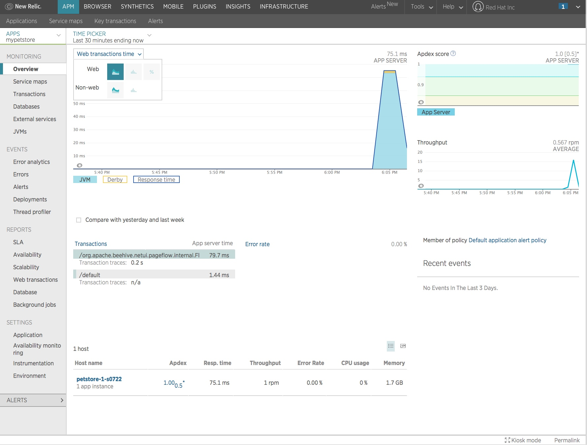

# Using New Relic with OpenShift

This example shows a way to configure New Relic to monitor an application running on OpenShift Container Platform. The repository includes a customized assemble script for Tomcat/JBoss EWS 8 to instrument an application using a New Relic Java Agent. The script for downloading and layering in New Relic agent is baked into this assemble script. 

In this example we will trigger a binary application deployment using a WAR file  (I will use petstore.war. You can use any application war file of your choice). 

### Prerequisites
1. You are registered with New Relic and have a valid license key

### Steps

**Step 1:** Clone the source code from the git repository that includes the customized assemble script for binary deployment.

```
$ git clone https://github.com/VeerMuchandi/newrelic-ews8
Cloning into 'newrelic-ews8'...
remote: Counting objects: 7, done.
remote: Compressing objects: 100% (5/5), done.
remote: Total 7 (delta 0), reused 7 (delta 0), pack-reused 0
Unpacking objects: 100% (7/7), done
```

This will create a directory with name ``newrelic-ews8``. Change into this folder.

``` cd newrelic-ews8 ```

**Step 2:** Create a Build

Review the `.s2i/bin/assemble` script. The script expects three environment variables during the build. 	

* `WAR_FILE_URL` that provides the URL for the application war that you are trying to deploy				
* `NEWRELIC_LICENSE` that provides the value for the New Relic license key
* `NEWRELIC_APPNAME` that provides the name of your application on the NewRelic console

We will now create a new build of type `binary`. I am deploying a `petstore.war` and naming my application as `petstore`. Note that I am supplying values for the three build environment variables explained above.

**Note** If you are copy-pasting, substitute your NewRelicLicenseKey.

```
$ oc new-build --binary --name=petstore -l app=petstore \
--image-stream=jboss-webserver30-tomcat8-openshift \
--env WAR_FILE_URL=https://raw.githubusercontent.com/VeerMuchandi/ps/master/deployments/ROOT.war  \
NEWRELIC_LICENSE=<<YourNewRelicLicenseKey>> \
NEWRELIC_APPNAME=mypetstore
--> Found image eee1cf7 (11 weeks old) in image stream "openshift/jboss-webserver30-tomcat8-openshift" under tag "latest" for "jboss-webserver30-tomcat8-openshift"

    JBoss Web Server 3.0 
    -------------------- 
    Platform for building and running web applications on JBoss Web Server 3.0 - Tomcat v8

    Tags: builder, java, tomcat8

    * A source build using binary input will be created
      * The resulting image will be pushed to image stream "petstore:latest"
      * A binary build was created, use 'start-build --from-dir' to trigger a new build

--> Creating resources with label app=petstore ...
    imagestream "petstore" created
    buildconfig "petstore" created
--> Success
```

You can run `oc describe bc/petstore` to view the build configuration that just got created.

**Step 3:** Start the build and deploy the application 

Now let us start the build by pushing the code from the current directory. This will upload the contents in the current directory and follow the build until it is complete. Note that it downloads the application war file from the location I specified, and the New Relic Java agent. It bakes it into the application container image and stores the image in the OpenShift Container Registry.

```
$ oc start-build petstore --from-dir=. --follow
Uploading directory "." as binary input for the build ...
build "petstore-1" started
Receiving source from STDIN as archive ...
DEPRECATED: Use .s2i/bin instead of .sti/bin

Veer - Custom code for binary deployment
https://raw.githubusercontent.com/VeerMuchandi/ps/master/deployments/ROOT.war
  % Total    % Received % Xferd  Average Speed   Time    Time     Time  Current
                                 Dload  Upload   Total   Spent    Left  Speed
100 6011k  100 6011k    0     0  3354k      0  0:00:01  0:00:01 --:--:-- 3354k
Beginning the deployment of New Relic Java agent
Downloading the latest java agent from New Relic...
  % Total    % Received % Xferd  Average Speed   Time    Time     Time  Current
                                 Dload  Upload   Total   Spent    Left  Speed
100 8688k  100 8688k    0     0  32.7M      0 --:--:-- --:--:-- --:--:-- 32.7M
New Relic file download complete, unzipping archive...
Archive:  newrelic.zip
creating: /opt/webserver/newrelic/
inflating: /opt/webserver/newrelic/newrelic.jar
inflating: /opt/webserver/newrelic/LICENSE
inflating: /opt/webserver/newrelic/CHANGELOG
inflating: /opt/webserver/newrelic/README.txt
inflating: /opt/webserver/newrelic/extension-example.xml
inflating: /opt/webserver/newrelic/extension.xsd
inflating: /opt/webserver/newrelic/newrelic.yml
inflating: /opt/webserver/newrelic/nrcerts
inflating: /opt/webserver/newrelic/newrelic-api.jar
inflating: /opt/webserver/newrelic/newrelic-api-sources.jar
inflating: /opt/webserver/newrelic/newrelic-api-javadoc.jar
Updating New Relic configuration file...
Adding JVM Argument for New Relic agent...
New Relic agent install complete


Pushing image 172.30.129.148:5000/newrelic/petstore:latest ...
Pushed 6/7 layers, 86% complete
Pushed 7/7 layers, 100% complete
Push successful
```

Now let us deploy this application. It uses the existing imagestream with name `petstore` and create the application deployment configuration and service. Following this, the deployment starts and a pod starts running.

```
$ oc new-app petstore -l app=petstore
--> Found image f249c21 (23 seconds old) in image stream "newrelic/petstore" under tag "latest" for "petstore"

    newrelic/petstore-1:f11326a6 
    ---------------------------- 
    Platform for building and running web applications on JBoss Web Server 3.0 - Tomcat v8

    Tags: builder, java, tomcat8

    * This image will be deployed in deployment config "petstore"
    * Ports 8080/tcp, 8443/tcp, 8778/tcp will be load balanced by service "petstore"
      * Other containers can access this service through the hostname "petstore"

--> Creating resources with label app=petstore ...
    deploymentconfig "petstore" created
    service "petstore" created
--> Success
    Run 'oc status' to view your app.
```

Next, expose the service to create a route.

```
$ oc expose svc petstore
route "petstore" exposed 
```

You can check the route created by running `oc get route`.

**Step 4:** Run the application and test in New Relic.

Use the above application in the browser for a little while.

Now go to your New Relic Console. Go to `New Relic APM`. You should find your application with the name you configured for `NEWRELIC_APPNAME`. In my case that is configured as `mypetstore` above. Click on the application name and you should start seeing the transaction data as shown below.



 


